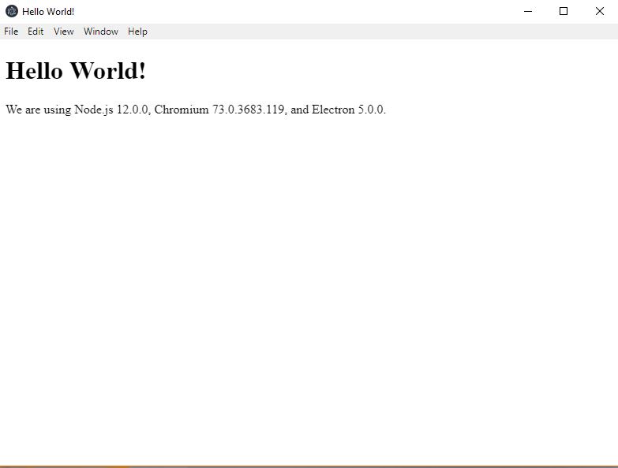
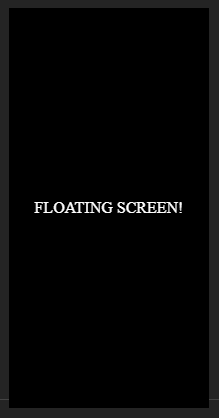

# ELECTRON FLOATING SCREEN

## Introduction

This tutorial deals with the creation of floating screens using Electron, specifically a Discord / Slack / GitKraken like loading screen.

[Electron](https://electronjs.org/) is an innovative system that allows you to create desktop / mobile applications taking advantage of all the power, comfort and quality of a web application.

## The author

My name is [Nicola Castellani](https://www.linkedin.com/in/nicola-castellani-313b9084/) and I'm a freelance fullstack developer (BE 40% FE 60%) from 2018. I mainly deal with REACT and Angular web applications, but also with 3D content, such as games, multimedia apps and webgl content.

## Getting Started

To begin, following the official guide of Electron, we are advised to start from their **boilerplate**:

1. Let's clone and build the basic Electron project:

```bash
git clone https://github.com/electron/electron-quick-start
```

2. Move to the root directory:

```bash
cd electron-quick-start
```

3. Install dependencies

```bash
npm install
```

4. Launch the project

```bash
npm start
```

If everything is successful, a Hello World by electron window will open!



## CREATE THE LOADING SCREEN

Now that we have started everything successfully, we just have to proceed with the creation of the loading screen.

In the project folder, inside the file **main.js**, you will find a method **createWindow**, which takes care of creating the main _BrowserWindow_ by loading the **index.html** file of the project.

The process to create a loading screen is very simple, in practice it's necessary to create a second _BrowserWindow_, which loads a separate **html** file, which we will call for convenience **loading.html**.

Let's proceed with the creation of this screen:

1. Create a separate directory for our loading screen:

```bash
mkdir windows/loading
cd windows/loading
```

2. Create the html file for the loading screen:

```bash
echo >> loading.html
```

3. We can copy and paste what is present in the index.html file or create an html document according with our needs. For this first step we copy the contents of the index.html file:

```html
<!DOCTYPE html>
<html>
  <head>
    <meta charset="UTF-8" />
    <title>Hello Loading World!</title>
  </head>
  <body>
    <h1>Hello Loading World!</h1>
    <!-- All of the Node.js APIs are available in this renderer process. -->
    We are using Node.js
    <script>
      document.write(process.versions.node);</script
    >, Chromium
    <script>
      document.write(process.versions.chrome);</script
    >, and Electron
    <script>
      document.write(process.versions.electron);</script
    >.

    <script>
      // You can also require other files to run in this process
      require('./renderer.js');
    </script>
  </body>
</html>
```

4. Once the loading.html file has been created, we need to modify the main.js file so that it loads the loading screen first, and then the main one:

```javascript
/// Before
app.on('ready', createWindow);
```

```javascript
/// After
app.on('ready', () =>
  createLoadingScreen();
  /// for now, let's comment this
  /// createWindow();
);
```

by this way the application, when ready, will call up the **createLoadingScreen** method, which will be defined later.

5. Definition of the **createLoadingScreen** method. This method allows us to instantiate a secondary window, used for loading:

```javascript
/// create a global var, wich will keep a reference to out loadingScreen window
let loadingScreen;
const createLoadingScreen = () => {
  /// create a browser window
  loadingScreen = new BrowserWindow(
    Object.assign({
      /// define width and height for the window
      width: 200,
      height: 400,
      /// remove the window frame, so it will become a frameless window
      frame: false,
      /// and set the transparency, to remove any window background color
      transparent: true
    })
  );
  loadingScreen.setResizable(false);
  loadingScreen.loadURL(
    'file://' + __dirname + '/windows/loading/loading.html'
  );
  loadingScreen.on('closed', () => (loadingScreen = null));
  loadingScreen.webContents.on('did-finish-load', () => {
    loadingScreen.show();
  });
};
```

In the main directory (electron-quick-start) if we launch the command **npm start** the application will be rendered starting from the loading screen, which at present has no style, so you will only see the strings of the html file. Let's proceed with the most creative part of our tutorial, the creation of the floating loading screen!

## LOADING SCREEN CUSTOMIZATION

At this point we just have to create a respectable loading screen.

1. Open the file _loading.html_, and define layouts, styles and more for the page:

```html
<!DOCTYPE html>
<html>
  <head>
    <meta charset="UTF-8" />
    <title>FLOATING LOADING SCREEN</title>
    <style>
      /* Define the main wrapper style */
      .LoaderWrapper {
        position: absolute;
        top: 0;
        left: 0;

        width: 100%;
        height: 100%;

        display: flex;
        align-content: center;
        justify-content: center;
        align-items: center;
        justify-items: center;

        box-sizing: border-box;
        background-color: black;
      }

      .LoaderContent {
        color: white;
      }
    </style>
  </head>
  <body>
    <div class="LoaderWrapper">
      <div class="LoaderContent">
        FLOATING SCREEN!
      </div>
    </div>

    <script>
      // You can also require other files to run in this process
      require('./renderer.js');
    </script>
  </body>
</html>
```

The result is the following:



Obviously this is an example, you can separate styles and logic in different files, for simplicity we keep everything in one file for the moment.

**PLUS** I strongly recommend using the unit **rem** (Responsive em), to manage any responsive behavior in relation to the font-size of the element **root**;

2. Once we have created our loading screen (think of it as an html page, you can do whatever you want, add preloaders, images, svg, webgl and much more), we need to manage the **dispose** event of the window, where the main window will show up.

Return to the file **main.js**, inside the function **createWindow** and add the following:

```javascript
[...]
/// keep listening on the did-finish-load event, when the mainWindow content has loaded
mainWindow.webContents.on('did-finish-load', () => {
  /// then close the loading screen window and show the main window
  if (loadingScreen) {
    loadingScreen.close();
  }
  mainWindow.show();
});
```

To ensure that the window is not shown as long as it is loaded, we need to review the way it is instantiated:

```javascript
mainWindow = new BrowserWindow({
  width: 800,
  height: 600,
  webPreferences: {
    nodeIntegration: true
  },
  /// show to false mean than the window will proceed with its lifecycle, but will not render until we will show it up
  show: false
})
[...]
```

3. Once we have defined the creation and dispose of the loading screen and the mainWindow, we need to restore the call to the **createWindow** function:

```javascript
[...]
app.on('ready', () => {
  createLoadingScreen();
  /// add a little bit of delay for tutorial purposes, remove when not needed
  setTimeout(() => {
    createWindow();
  }, 2000);
})
[...]
```

By running the **npm start** command again, you can check the loading screen operation, it remains visible for about 2 seconds and then it's destroyed, to show up the main window.

## CONCLUSIONS

This tutorial ends here, by this way you can create also dialog boxes or secondary windows that can be created and destroyed depending on the main window.

For example in my last project I revisited the default windows that are shown as **alert()** or **confirm()**, intercepting the javascript events from the main window and thus creating much more beautiful and aligned window alternatives to the operating system that hosts the application.
